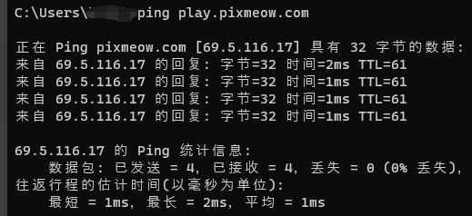

# 常见问题与解答 :id=faq

## 服务器的游戏规则 :id=rules

我们制定了[PixCraft 规则](welcome/rules.md)

## 客户端无法启动
- 请检查是否安装最新Java 8 **64位** 版本
- 请确保游戏的运行内存为 2G

## 服务器无法链接

!> 目前服务器由于海外物理连接问题会出现无法连接，游玩卡顿等问题，现在正在全力解决。

- 首先打开 CMD(可以系统搜索 win + S "cmd") 然后输入`ping play.pixmeow.com`

检查里面的 时间栏 如果时间在 240 ms 以下，则可以直接IP为 `play1.pixmeow.com` 的服务器，否则需要连接国内专用 `burnsky.pixmeow.com`

## 客户端出问题了&服务器出现问题了怎么联系管理组 :id=how-to-contact

- 群内：
  @群管理即可，或者私信

- 开黑吧:
  在 [问题反馈频道](https://kaihei.co/IAALCU) 里发布 或者 @管理